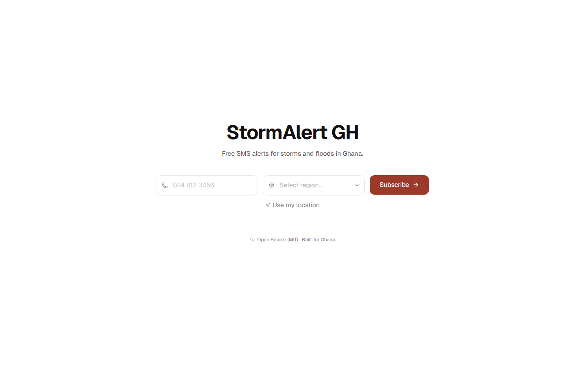

# StormAlert GH

Open-source storm and flood-risk SMS alerts for Ghana.

StormAlert GH lets people subscribe with a Ghana phone number and region, verifies the number with an OTP, monitors weather conditions by region, and sends SMS alerts when storm or flood-risk thresholds are crossed.



## Features

- Mobile-first subscribe and OTP verification flow
- Arkesel OTP with USSD fallback guidance
- Region-aware weather polling with Open-Meteo
- Protected cron endpoint for GitHub Actions schedules
- STOP/unsubscribe webhook endpoint for Arkesel inbound replies
- Neon Postgres persistence through Prisma
- Focused unit coverage for phone parsing, OTP helpers, and alert evaluation

## Stack

- Next.js 16 App Router
- React 19
- Tailwind CSS 4
- Prisma 7
- Neon Postgres
- Open-Meteo
- Arkesel SMS/OTP
- GitHub Actions
- Vercel

## Getting Started

Install dependencies:

```bash
pnpm install
```

Copy the environment template:

```bash
cp .env.example .env
```

Fill in the Neon, Arkesel, and cron values in `.env`, then run:

```bash
pnpm prisma:generate
pnpm prisma:migrate
pnpm dev
```

Open `http://localhost:3000`.

## Useful Commands

```bash
pnpm lint
pnpm typecheck
pnpm test:run
pnpm build
pnpm prisma:generate
pnpm prisma:migrate
pnpm prisma:deploy
```

## Environment

Use the pooled Neon connection string for `DATABASE_URL` and the direct Neon connection string for `DIRECT_URL`.

Required production values:

```env
DATABASE_URL=""
DIRECT_URL=""
CRON_SECRET=""
ARKESEL_API_KEY=""
ARKESEL_SENDER_ID="StormGH"
ARKESEL_API_BASE_URL="https://sms.arkesel.com"
ARKESEL_WEBHOOK_SECRET=""
ALERT_COOLDOWN_HOURS="6"
OTP_EXPIRY_MINUTES="10"
OTP_PEPPER=""
NEXT_PUBLIC_APP_NAME="StormAlert GH"
NEXT_PUBLIC_ARKESEL_USSD_CODE="*928*01#"
```

Never commit `.env` or real credentials.

For the Arkesel STOP webhook, include the same `ARKESEL_WEBHOOK_SECRET` as a query parameter or header:

```text
https://your-domain.example/api/webhooks/arkesel?secret=YOUR_SECRET
```

## Project Structure

```text
app/                 Next.js routes, pages, and route handlers
app/_components/     Client UI components
lib/                 Domain logic, API clients, validation, Prisma helpers
prisma/              Database schema and migrations
public/screenshots/  README and project screenshots
docs/                Architecture and deployment notes
.github/             GitHub Actions and community templates
```

## Documentation

- [Architecture](docs/ARCHITECTURE.md)
- [Deployment](docs/DEPLOYMENT.md)
- [Screenshots](docs/SCREENSHOTS.md)
- [Specification](StormAlertGH_Spec_v2.md)
- [Stack facts](StormAlertGH_Stack_Facts_2026.md)

## Contributing

Contributions are welcome. Please read [CONTRIBUTING.md](CONTRIBUTING.md), [CODE_OF_CONDUCT.md](CODE_OF_CONDUCT.md), and [SECURITY.md](SECURITY.md) before opening issues or pull requests.

## License

MIT. See [LICENSE](LICENSE).
